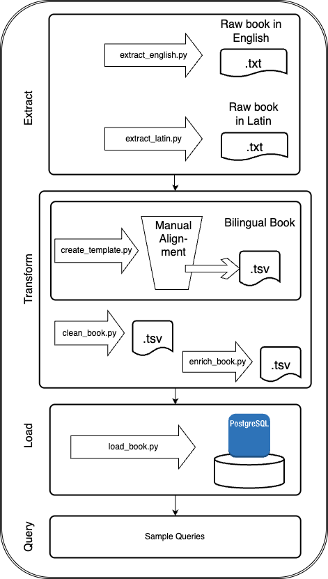

# Classic Book ETL Pipeline — *The Imitation of Christ*

# Word Frequency Pipeline

[](#)
[](#)
[](#)
[](#)

---

## Table of Contents
- [Executive Summary](#executive-summary)
- [Problem & Motivation](#problem--motivation)
- [Data Structure & Raw Input](#data-structure--raw-input)
- [Methodology & ETL Architecture](#methodology--etl-architecture)
- [Repository Structure](#repository-structure)
- [Tools & Technologies](#tools--technologies)
- [Setup & Execution](#setup--execution)
- [Results & Sample Insights](#results--sample-insights)
- [Conclusion & Future Improvements](#conclusion--future-improvements)
- [Appendix & Resources](#appendix--resources)

---

## Executive Summary

- An end-to-end ETL pipeline that scrapes, cleans, and aligns Latin and English versions of the spirituañ classic book *The Imitation of Christ*, storing the final dataset in a PostgreSQL database.

---

##  Problem & Motivation

Most classic spiritual texts are available in multiple languages, but rarely are they presented in a format that allows **structured, bidirectional comparison** between the original and its translation. Scholars, students, and spiritually curious readers alike often want to ask:

- “What is the Latin original of this English phrase?”
- “How are certain key spiritual terms rendered across the text?”
- “Is the paragraph structure preserved across languages?”

---

## Data Structure & Raw Input

About the structure of the Book, specially in Latin, which mantains the classic subchapter divission.

---

##  Methodology & ETL Architecture



**1. Extract**

- Scraped the Latin text from *The Latin Library*
- Scraped the English text from *Christian Classics Ethereal Library*
- Stored raw texts in plain `.txt` files, preserving natural paragraph breaks

**2. Transform**

- Created a template for manual alignment, using `generate_latin_alignment_csv.py`
- Manually aligned each book by paragraph (over 650 matches) using a structured TSV template.
- Saved bilingual TSV files, 4 in total, one per book.
- Automated cleaning using `clean_imitation.py`
- Got a `imitation_cleaned.tsv`ready to load into PostgreSQL

**3. Load**

- Designed PostgreSQL schema 
- Loaded cleaned bilingual `imitation_cleaned.tsv` composed of 9 columns

---

## Repository Structure

```
classicbook-etl-pipeline/
├── data/ 
│   ├── raw/                        # Raw text files from Latin and English sources
│   ├── aligned/                    # 4 manually aligned bilingual books (TSV)
│   ├── clean/                      # Final cleaned TSV file for DB loading
│   ├── output/                     #   
│   ├── manual_template.csv         # Template for manual alignment
│   └── README.md
├── src/
│   ├── extract/
│   │   ├── extract_latin.py        # Extracts the Latin text
│   │   ├── extract_english.py      # Extracts the English text
│   │   └── README.md    
│   ├── transform/
│   │   ├── manual_alignment.py     # Creates template for manual alignment
│   │   ├── clean_imitation.py      # Cleans and enrich the CSV file
│   │   └── README.md
│   └── load/
│       ├── load_to_sql.py          # Loads final CSV to sql
│       └── README.md
├── config/                         # Environment configs (env vars, YAML settings)
│   ├── .env.example                # Sample .env file for secrets/paths
│   └── config.yaml      
├── main/
│   ├── run_pipeline.py             # Main runner: connects E → T → L
│   └── README.md
├── tests/                          # Unit tests (pytest-compatible)
│   ├── test_transform.py
│   └── test_load.py
├── Dockerfile
├── requirements.txt                # Python dependencies
├── .gitignore
├── README.md                       # Project overview and instructions
└── LICENSE
```
---

##  Tools & Technologies

- **Languages**: Python, SQL
- **Tools**: VS Code, Git, GitHub, pgAdmin, PostgreSQL

---

## Setup & Execution

Write...

---

## Results & Sample Insights

Rewrite....

This project creates a **clean, bilingual, paragraph-aligned dataset** of *The Imitation of Christ* in Latin and English — stored in a SQL database and fully queryable — to support:

- **Semantic lookup**: Find the Latin equivalent of an English passage, and vice versa
- **Translation analysis**: Explore how Latin words and themes are rendered in context
- **Concept tracking**: Follow the use of key spiritual terms like *humilitas*, *gratia*, or *imitatio*
- **Structural exploration**: Analyze the organization of the book — books, chapters, paragraphs, and words frequency

Once the data is loaded, it becomes a powerful tool for:

- Searching for Latin equivalents of English passages
- Analyzing how a spiritual concept (e.g., “grace”) is expressed across the text
- Creating datasets for Latin language learners or theology students
- Exploring paragraph frequency, length, and structure across books
- Generating dynamic flashcards and quizzes from the text

The goal of this ETL pipeline has been achieved. The data is fully aligned, loaded into PostgreSQL, and now queryable.

You can explore the final SQL schema, queries, and analysis in:

[`sql/sample_queries.md`](./sql/sample_queries.md)

This includes:

- Retrieving the Latin title of each book
- Counting verses by book
- Searching for keywords in Latin
- Comparing word counts between Latin and English

---

## Conclusion & Future Improvements

> “Scientia est ordinatio rerum in ratione.”  
> *Knowledge is the ordering of things according to reason.*

This project was more than an academic or technical exercise — it was a spiritual and intellectual labor. Manual alignment was slow, but meaningful. It mirrors the discipline of a data engineer: **trust in structure, reverence for clarity, and devotion to detail**.

---

## Appendix & Resources

- Sources
- Short article about the Book Itself

---

**Juan David Bravo**  
Aspiring Data Engineer with a background in classical languages and philosophy.  
Bridging ancient texts with modern data pipelines.

---
