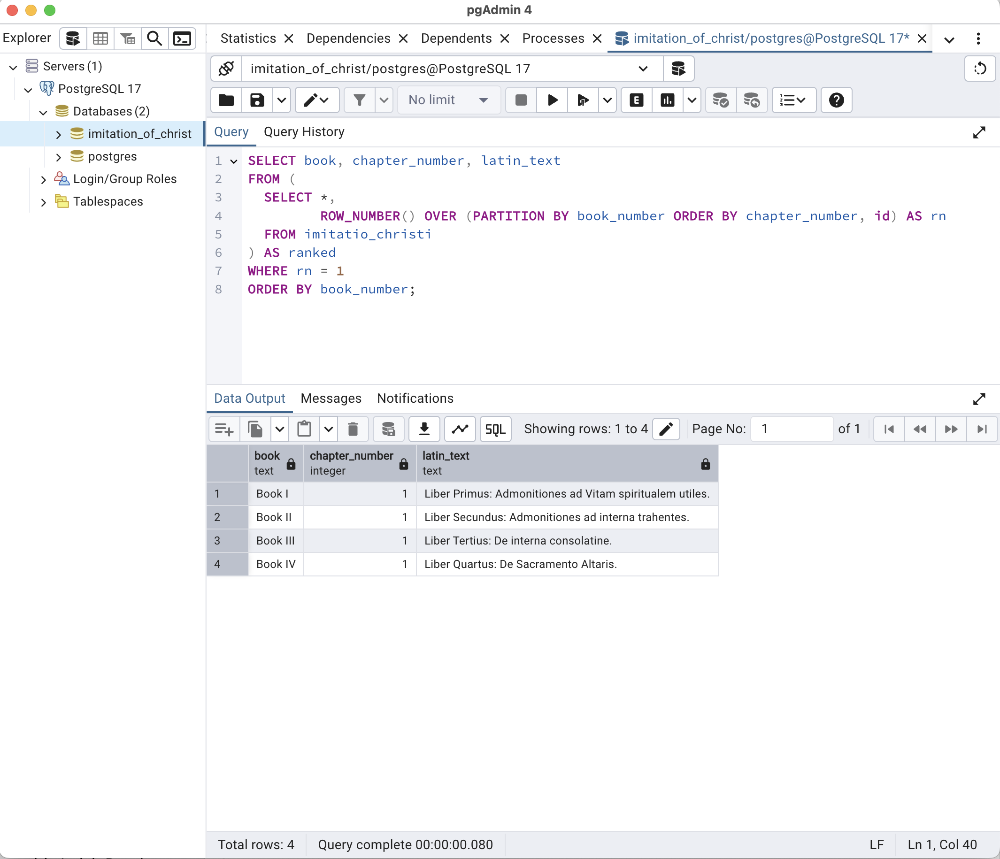
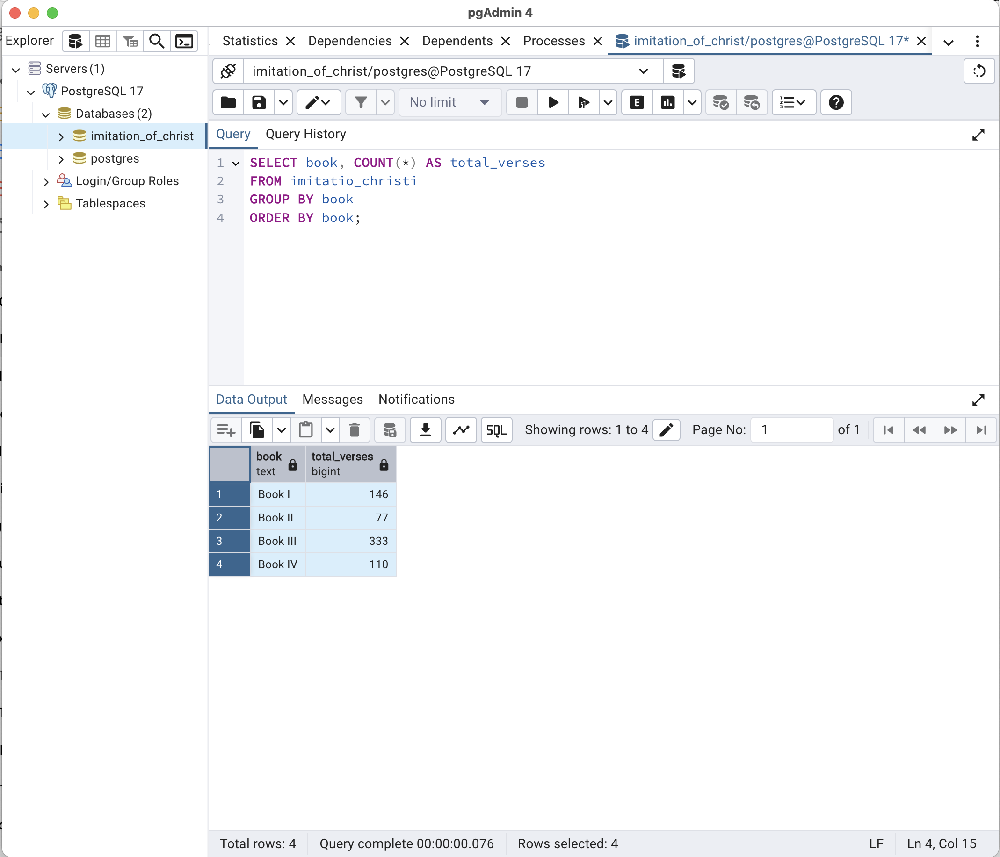
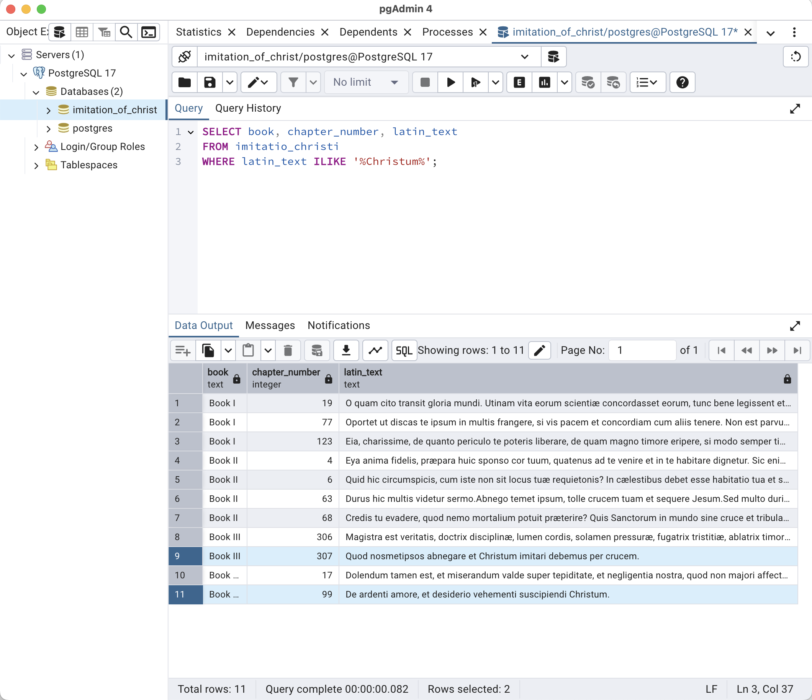
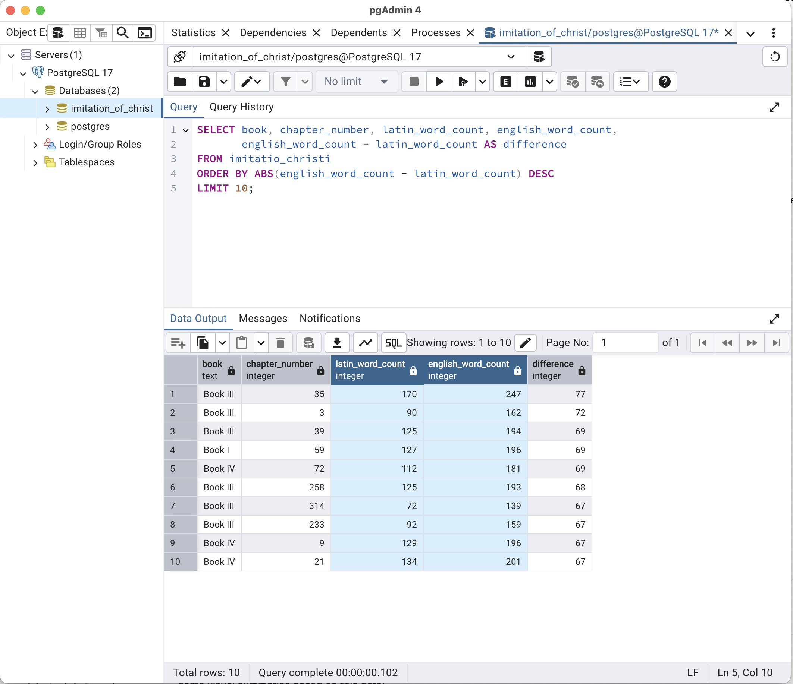

# 📑 Sample SQL Queries – ClassicBook ETL

This document contains a set of queries executed on the `imitatio_christi` table within the **Imitation_of_Christ** PostgreSQL database. These queries aim to explore the Latin and English alignment, verse structure, and stylistic features of *The Imitation of Christ*.

---

## 1. 📘 Retrieving the Titles of Each Book in Latin

**Purpose**:  
To preview the Latin titles of each book in *The Imitation of Christ*, ordered by book and chapter. 
This helps confirm data integrity and the order of the aligned texts.

```sql
SELECT book, chapter_number, latin_text
FROM (
  SELECT *,
         ROW_NUMBER() OVER (PARTITION BY book_number ORDER BY chapter_number, id) AS rn
  FROM imitatio_christi
) AS ranked
WHERE rn = 1
ORDER BY book_number;
```

**Screenshot**:  


---

## 2. 📊 Counting Verses by Book

**Purpose**:  
To analyze the structure and length of each book by counting how many verses it contains. This provides insights into the distribution and size of content.

```sql
SELECT book, COUNT(*) AS total_verses
FROM imitatio_christi
GROUP BY book
ORDER BY book;
```

**Screenshot**:  


---

## 3. 🔍 Searching for Keywords in Latin

**Purpose**:  
To locate specific theological or devotional terms in the Latin original — for example, all verses mentioning *Christum*. This demonstrates how to perform textual analysis using SQL.

```sql
SELECT book, chapter_number, latin_text
FROM imitatio_christi
WHERE latin_text ILIKE '%Christum%';
```

**Screenshot**:  


---

## 4. 🧮 Comparing Word Counts

**Purpose**:  
To compare verbosity between Latin and English across the entire text. This allows a basic stylistic and translation analysis — for example, is English usually longer?

```sql
SELECT book, chapter_number, latin_word_count, english_word_count,
       english_word_count - latin_word_count AS difference
FROM imitatio_christi
ORDER BY ABS(english_word_count - latin_word_count) DESC
LIMIT 10;
```

**Screenshot**:  


---

> 📁 All screenshots can be found in the [`sql/screenshots/`](./screenshots/) folder.